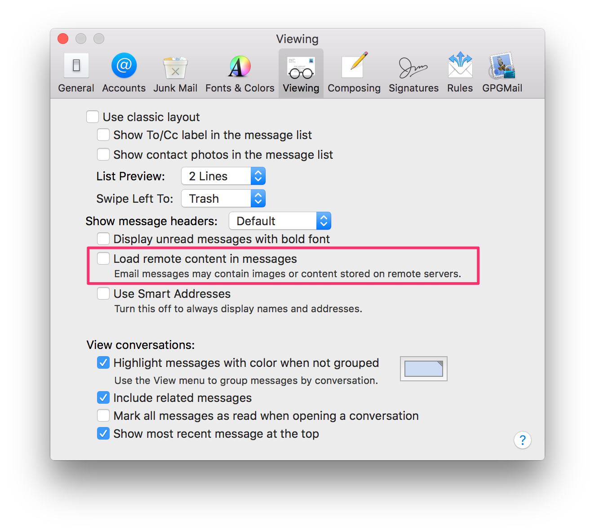
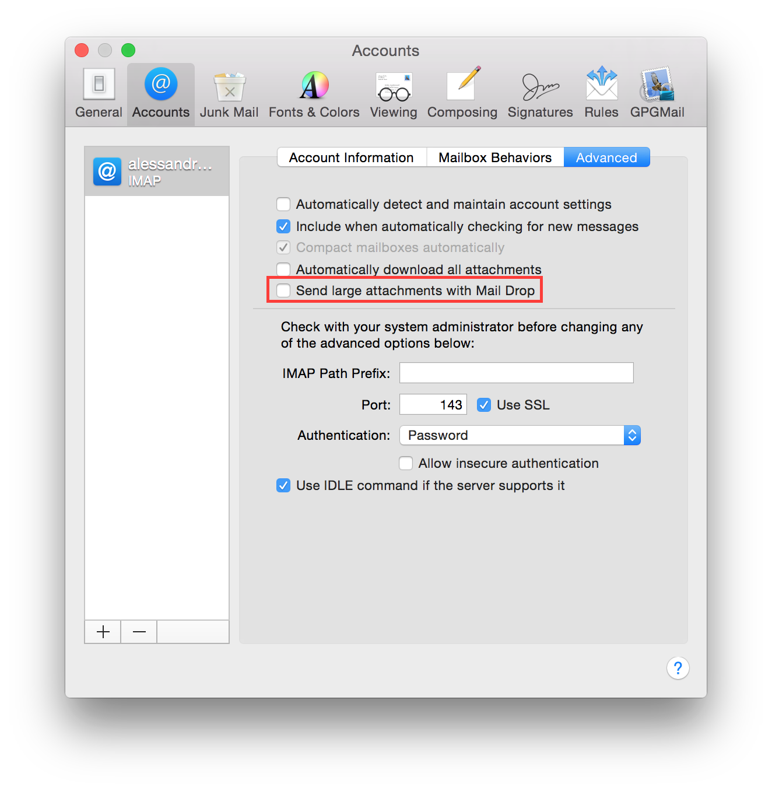
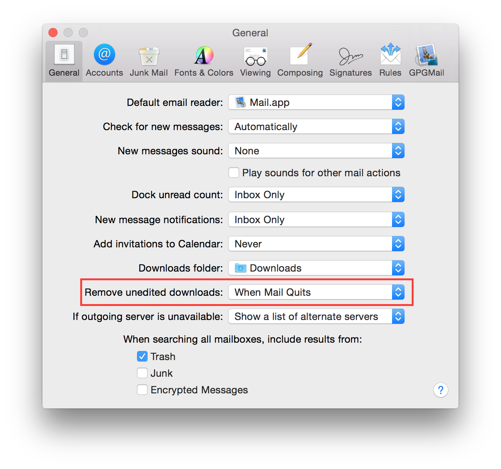

Apple Mail 8 / 9
----------------

Apple Mail is a mail client application shipped by default with Max OS X.

This chapter is dedicated to configuring Apple Mail version 8.x and 9.x.  THey come by default with Mac OS X 10.10
(Yosemite) and Mac OS X 10.11 (El Capitan).

.. contents::
   :local:

Disable automatic loading of remote content
^^^^^^^^^^^^^^^^^^^^^^^^^^^^^^^^^^^^^^^^^^^

Mail defaults to automatically load any images, styles etc, that are included in any email, regardless of sender.  Not
only can this be an attack-vector, but it's also commonly used for tracking, leading to loss of privacy.

Don't worry about disabling the automatic loading though, you'll still be able to load remote images and stylesheets for
any mail with a single click.

To disable automatic loading of remote content, go to:

    Open Apple Mail  ⇒ Preferences ⇒ Viewing

Uncheck "Load remote content in messages".

Disable automatic account settings
^^^^^^^^^^^^^^^^^^^^^^^^^^^^^^^^^^

If this options is enabled Mail automatically manage settings for your email account in Mail, such as port numbers
and authentication methods.
It is not suggested to not leave Mail the control over so critical settings and disable this option.

To disable automatic account settings, go to:

    Open Apple Mail  ⇒ Accounts ⇒ Select your mail account ⇒ Advanced

Uncheck "Automatically detect and maintain account settings".

.. image:: images/mail_4.png
   :align: center

Disable automatic attachment download
^^^^^^^^^^^^^^^^^^^^^^^^^^^^^^^^^^^^^

If this options is enabled Mail automatically downloads all attachments for your email account in Mail.
It is suggested to keep the control over what is downloaded so disable this option, automatically download
attacchments is pretty dangerous, just think to someone sending you an email with an image on a controlled
server, he could be able to track your IP address.

It is suggested to disable automatic attachments download, go to:

    Open Apple Mail  ⇒ Accounts ⇒ Select your mail account ⇒ Advanced

Uncheck "Automatically download all attachments".

.. image:: images/mail_5.png
   :align: center

If you want to definitely block any connections it is suggested to configure a firewall, i.e. Little Snitch,
and permit connections starting from Mail.app only to your mail server.

Disable MailDrop
^^^^^^^^^^^^^^^^

MailDrop is a new feature is Yosemite which allows you to deliver large size attachment, they are uploaded to Apple Cloud
and then fetched by your recipients. This is a great feature but it needs to disclose your file to Apple Cloud.
It is suggested to disable this feature and use other technolgy under your full control to transfer big files.

To disable invitation import, go to:

    Open Apple Mail  ⇒ Accounts ⇒ Select your mail account ⇒ Advanced

Uncheck "Send large attachments with Mail Drop".

Never add invitations to calendar automatically
^^^^^^^^^^^^^^^^^^^^^^^^^^^^^^^^^^^^^^^^^^^^^^^

Apple Mail has the feature to automatically add invitations to your calendar.
It is suggested to not allow Apple Mail to automatically parse invitations and launch an external application to avoid
possible future exploitation with a new vulnerability.

To disable invitation import, go to:

    Open Apple Mail  ⇒ General

Set "Add invitations to Calendar" to "Never".

.. image:: images/mail_1.png
   :align: center

Never add invitations to calendar automatically
^^^^^^^^^^^^^^^^^^^^^^^^^^^^^^^^^^^^^^^^^^^^^^^

If you open an attachment in Apple Mail, it stores the file in your disk, inside your attachment download folder, and by
default leaves it forever.
It is not suggested to leave mail attachements on disk, because they can be some kind of untrusted files.

To remove downloaded files, go to:

    Open Apple Mail  ⇒ General

Set "Remove unedited downloads" to "When Mail Quits".

Use only SSL/TLS protocols
^^^^^^^^^^^^^^^^^^^^^^^^^^

Classic mail protocols like SMTP, POP and IMAPS are plain text protocol without any encryption, it means your data and
credentials are send in plain text.
It is suggested to use only encrypted protocols.
Ask your email provider for encrypted email protocols support and configure your mail account properly.

To configure your email account, go to:

    Open Apple Mail  ⇒ Accounts

Using GPG
^^^^^^^^^

GPG is a software to encrypt, decrypt, sign and verify files or messages. It is widely used and its adoption is
suggested to protect your privacy.

`GPGTools <https://gpgtools.org/>`_ is a suite designed to bring GPG on Mac OS X and add encryption to Apple Mail.

It is suggested to download and install `GPGTools <https://gpgtools.org/>`_.
