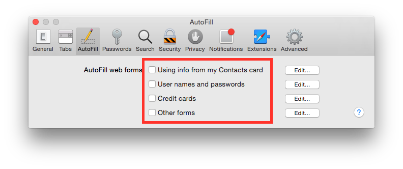
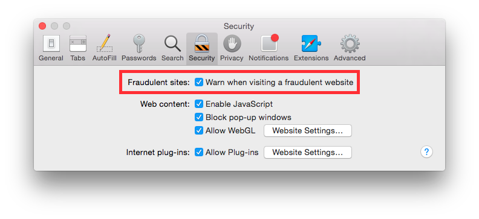

Apple Safari 8
--------------

According to `Wikipedia <https://en.wikipedia.org/wiki/Safari_(web_browser)>`_ Safari is *"a web browser developed by
Apple Inc. included with the OS X and iOS operating systems. First released as a public beta on January 7, 2003, on the
company's OS X operating system, it became Apple's default browser beginning with Mac OS X v10.3 "Panther".
The native browser of iOS is also called Safari, but has a different UI and uses a different WebKit version and API"*.

This chapter is dedicated to configuring Apple Safari version 8.x. It comes by default with Mac OS X 10.10 (Yosemite).

.. contents::
   :local:

Change default search engine
^^^^^^^^^^^^^^^^^^^^^^^^^^^^

Change default search engine to `DuckDuckGo <https://duckduckgo.com/>`_, it is a search engine who takes care of your privacy.
Go to:

    Open Safari ⇒ Preferences ⇒ Search

Set “Search engine” to “DuckDuckGo”.

.. image:: images/safari_search_1.png
   :align: center

Clear history
^^^^^^^^^^^^^

Used to never leave navigation traces in browser history.
Go to:

    Open Safari ⇒ Preferences ⇒ General

Set “Remove history items” to “After one day”.
Set “Remove download list items” to “Upon successful download”.

.. image:: images/safari_general_3.png
   :align: center

Control third party plugins
^^^^^^^^^^^^^^^^^^^^^^^^^^^

Most browsers allow the continuous running of all third party scripts, giving malware an huge surface area of attack
to get into your machine.
Safari can ask for user permission each time a plugin is run, this is a good practice to control which website is asking
your browser to run a plugin.
It is suggested to control the run of WebGL plugins, go to:

    Open Safari ⇒ Preferences ⇒ Security

Check “Allow WebGL” and click on "Website Settings...", set "When visiting other websites" to "Ask".

.. image:: images/safari_security_2.png
   :align: center

It is suggested to control the run of WebGL plugins, go to:

    Open Safari ⇒ Preferences ⇒ Security

Check “Allow Plug-ins” and click on "Website Settings...", set "When visiting other websites" to "Ask".

.. image:: images/safari_security_3.png
   :align: center

Disable AutoFill
^^^^^^^^^^^^^^^^

Disables automatic fill of forms.
Go to:

    Open Safari ⇒ Preferences ⇒ AutoFill

Unckeck all boxes.

Disable AutoFill username and passwords
^^^^^^^^^^^^^^^^^^^^^^^^^^^^^^^^^^^^^^^

Disables automatic fill of forms with usernames and passwords.
Go to:

    Open Safari ⇒ Preferences ⇒ Passwords

Uncheck “AutoFill user names and passwords”.

.. image:: images/safari_passwords_1.png
   :align: center

Disable open files after download
^^^^^^^^^^^^^^^^^^^^^^^^^^^^^^^^^

Disables automatic opening of downloaded file, even if they are safe. It is suggested to never run arbitrary files
downloaded.
Go to:

    Open Safari ⇒ Preferences ⇒ General

Uncheck “Open ‘safe’ files after downloading”.

.. image:: images/safari_general_4.png
   :align: center

Disable search suggestions
^^^^^^^^^^^^^^^^^^^^^^^^^^

Disables suggestions to avoid leaking potential data when typing in the search box.
Go to:

    Open Safari ⇒ Preferences ⇒ Search

Uncheck “Include search engine suggestions”.
Uncheck “Include Spotlight suggestions”.

.. image:: images/safari_search_2.png
   :align: center

Disable website tracking
^^^^^^^^^^^^^^^^^^^^^^^^

Disables website tracking asking sites to do not track.
Go to:

    Open Safari ⇒ Preferences ⇒ Privacy

Check “Ask website not to track me”.

.. image:: images/safari_privacy_1.png
   :align: center

Open with a private window
^^^^^^^^^^^^^^^^^^^^^^^^^^

Set Safari to open only in new private window to keep your privacy.
Go to:

    Open Safari ⇒ Preferences ⇒ General

Set “Safari opens with” to “A new private window”.

.. image:: images/safari_general_1.png
   :align: center

Open with an empty page
^^^^^^^^^^^^^^^^^^^^^^^

Set Safari to open new windows and tabs with an empty page.
Go to:

    Open Safari ⇒ Preferences ⇒ General

Set “New windows open with” to “Empty Page”.
Set “New tabs open with” to “Empty Page”.

.. image:: images/safari_general_2.png
   :align: center

Show website address
^^^^^^^^^^^^^^^^^^^^

By default Safari shows only the domain in the address bar, it is suggested to show the whole website address.
Go to:

    Open Safari ⇒ Preferences ⇒ Advances

Check “Show full website address”.

.. image:: images/safari_advanced_1.png
   :align: center

Warn when visiting a fraudulent website
^^^^^^^^^^^^^^^^^^^^^^^^^^^^^^^^^^^^^^^

Safari can check the website you are visiting against a public and free feed on malicious websites.
It is suggested to enable fraudulent website detection, go to:

    Open Safari ⇒ Preferences ⇒ Security

Check “Warn when visiting a fraudulent website”.

