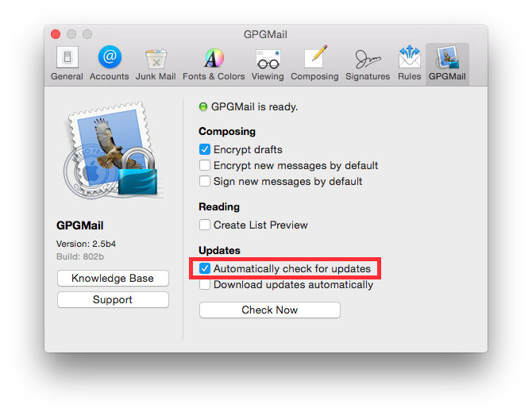
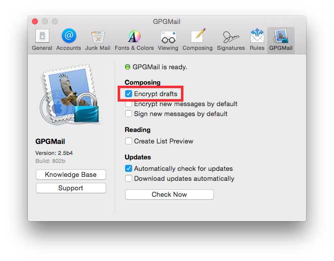

GPG Suite
---------

According to `GPG Tools official website <https://gpgtools.org/>`_ GPG Tools is used *"to encrypt, decrypt, sign and
verify files or messages. Manage your GPG Keychain with a few simple clicks and experience the full power of GPG"*.
GPG Suite is an implementation of GPG for Mac OS X with a keychain and an Apple Mail extension.

.. contents::
   :local:

Automatic update check
^^^^^^^^^^^^^^^^^^^^^^

It is recommended to keep software always updated.
To enable automatic update check, go to:

    Open Apple Mail  ⇒ Preferences ⇒ GPGMail panel

Check "Automatically check for updates" option.

Check installation package signature
^^^^^^^^^^^^^^^^^^^^^^^^^^^^^^^^^^^^

The installation package is provided with an hash signature and a GPG signature.
It is recommended to check digital signature before the installation.

Encrypt drafts
^^^^^^^^^^^^^^

It is recommended to store mail drafts in an encrypted format, to avoid leak of draft emails saved in clear text.
To enable drafts encryption, go to:

    Open Apple Mail  ⇒ Preferences ⇒ GPGMail panel

Check "Encrypt drafts" option.

