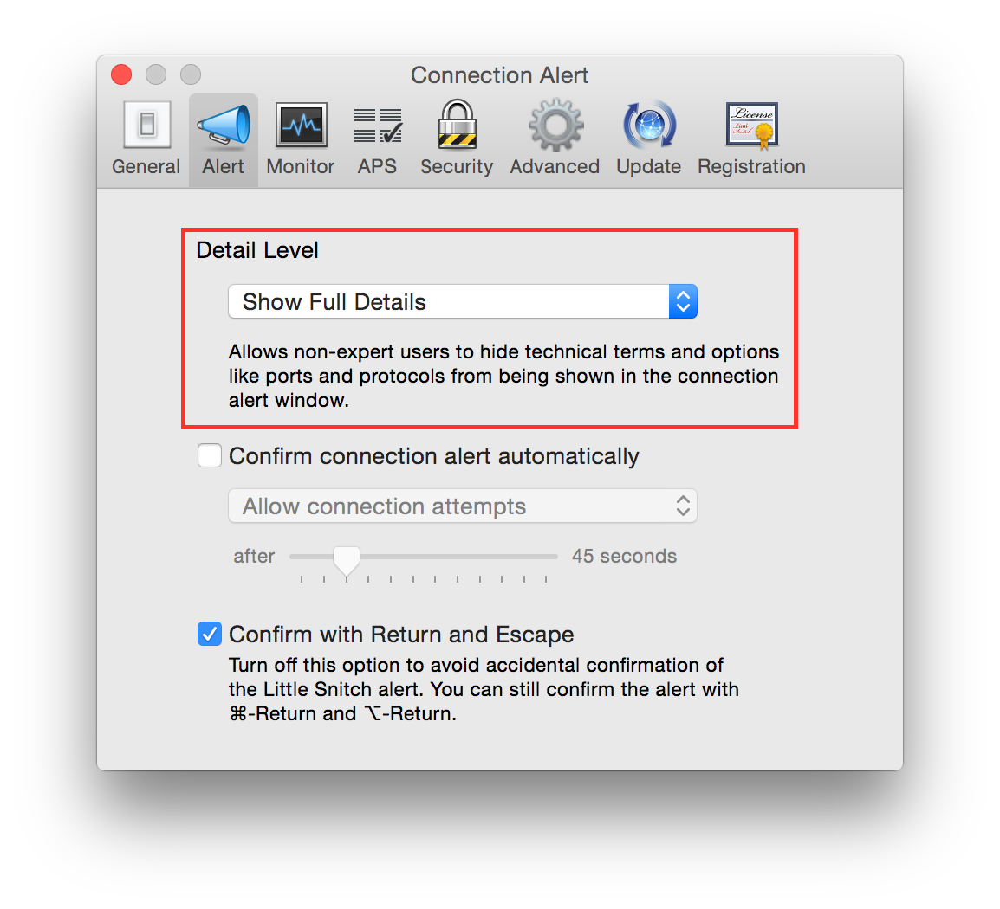
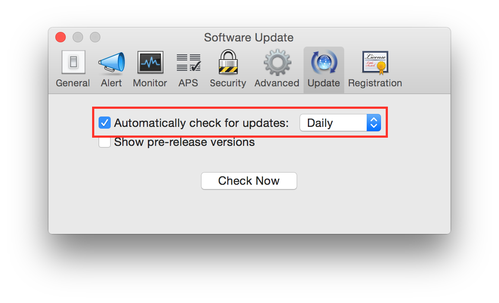
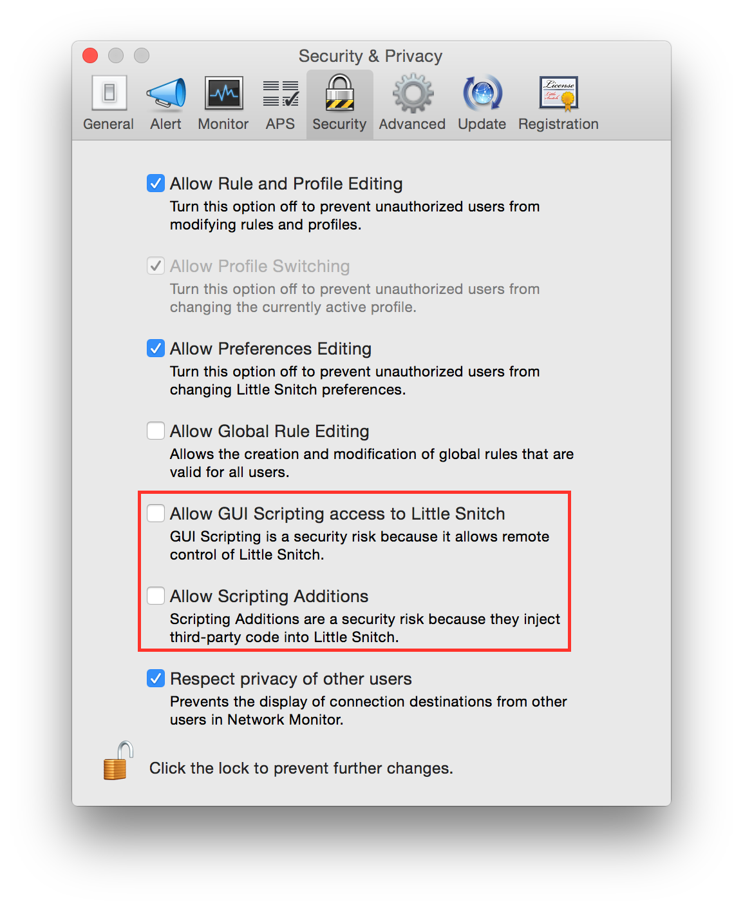
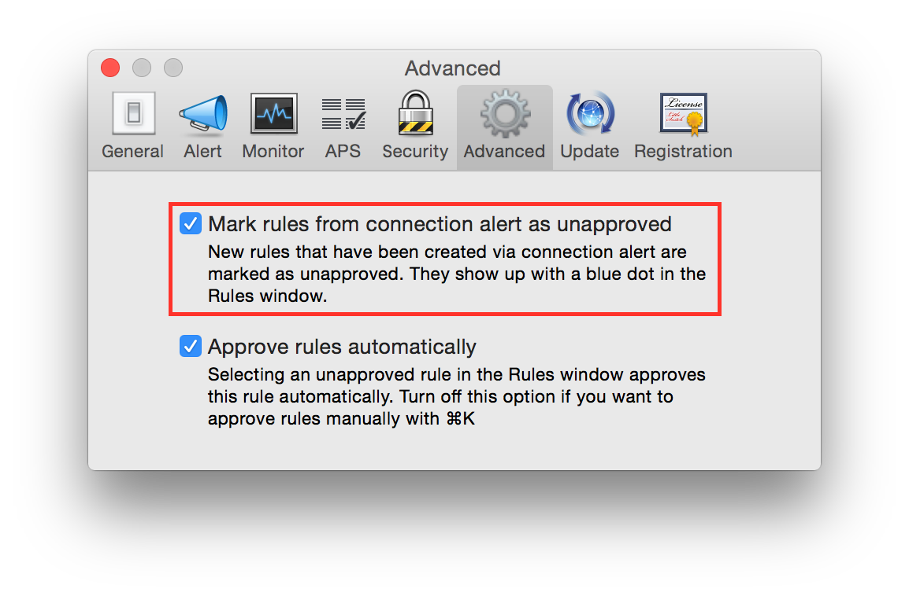

LittleSnitch 3
--------------

According to the vendor `website <https://www.obdev.at/products/littlesnitch/index.html>`_ LittleSnitch is *"a firewall
that intercepts unwanted connection attempts, and lets you decide how to proceed"*.

It is really common, and a best practice, to replace Mac OS X default firewall with a more advanced firewall like Little
Snitch.

This chapter is dedicated to configuring Little Snitch 3.

.. contents::
   :local:

Show full details
^^^^^^^^^^^^^^^^^

It is suggested to enable an advanced mode to all event's details.
Start Little Snitch.
Go to:

    Preferences ⇒ Alert

Set "Detail Level" to "Show Full Details".

Enable update check
^^^^^^^^^^^^^^^^^^^

By default automatic update check is disabled, it is suggested to enable it.
Start Little Snitch.
Go to:

    Preferences ⇒ Update

Check "Automatic check for updates" and set it to "Daily".

Disable scripting access
^^^^^^^^^^^^^^^^^^^^^^^^

Scripting access is a security risk because a malicious software could be able to add rules to LittleSnitch and/or modify its behavior.
It is suggested to disable it, it is usually disabled by default.
Start Little Snitch.
Go to:

    Preferences ⇒ Security

Un-check "Allow GUI Scripting access to Little Snitch".
Un-check "Allow Scripting Additions".

Mark ruled as unapproved
^^^^^^^^^^^^^^^^^^^^^^^^

By default rules created with the alert window are auto approved. It is a good practice to create it as not approved, and review them all later.
Start Little Snitch.
Go to:

    Preferences ⇒ Advanced

Check "Mark rules from connection alert as unapproved".

