Mac OSX 10.12 Sierra
--------------------

According to `Wikipedia <https://en.wikipedia.org/wiki/MacOS_Sierra>`_ Sierra
is *"(version 10.12) is the thirteenth major release of macOS (previously OS X),
Apple Inc.'s desktop and server operating system for Macintosh computers.
The successor to OS X El Capitan, it is the first version of the operating system
issued under the June 2016 rebranding as macOS. Sierra is named after California's
Sierra Nevada mountain range. Its major new features concern Continuity, iCloud,
and windowing, as well as support for Apple Pay and Siri."*.

.. contents::
   :local:

Applications
^^^^^^^^^^^^

It is suggested to keep the */Applications/* directory as clean as possible,
having a separate *Applications* directory for your apps.
Just create a folder named “Applications” in your home directory (or where you
like) and install (move) all applications there. Apps installed via App Store or some
special apps cannot live in a custom Applications folder, so you have to keep
them in the original Applications.

Allow only signed apps
^^^^^^^^^^^^^^^^^^^^^^

It is suggested to never run untrusted code not signed with a proper key.
To allow only apps signed by an authorized developer, go to:

    System Preferences ⇒ Security & Privacy ⇒ General

Set "Allow apps download from" to "Mac App Store and identified developers" or
if you want to be more strict and you install applications only via App Store
set it to "Mac App Store".
In OS X Sierra is now not possible to choose to run unsigned code, it was in OS
X El Capitan.

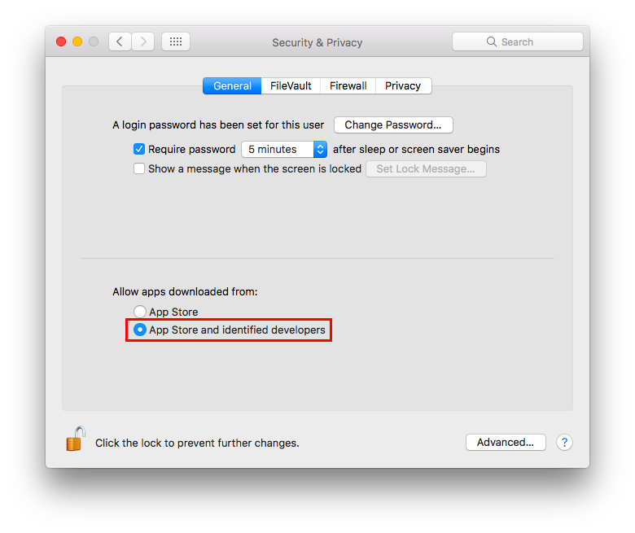

Check Privacy permissions
^^^^^^^^^^^^^^^^^^^^^^^^^

OS X allows you to track all applications requesting access to some sort of
sensitive data, for example your location or your contacts.
It is suggested to periodically check the list of applications requesting access
to sensitive data and review their permissions.
To show the list of these applications go to:

    System Preferences ⇒ Security & Privacy ⇒ Privacy

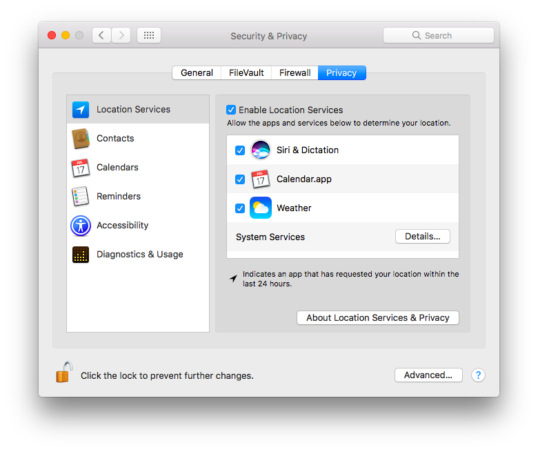

Destroy FileVault Keys
^^^^^^^^^^^^^^^^^^^^^^

By default File Vault keys are kept when system goes in standby mode.
As suggested by *man pmset*::

  destroyfvkeyonstandby - Destroy File Vault Key when going to standby
     mode. By default File vault keys are retained even when system goes to
     standby. If the keys are destroyed, user will be prompted to enter the
     password while coming out of standby mode.(value: 1 - Destroy, 0 -
     Retain)

It is suggested to configure your system to destroy File Vault keys when enterging
in standy mode with the following command::

  sudo pmset destroyfvkeyonstandby 1

Disable Creation of Metadata Files
^^^^^^^^^^^^^^^^^^^^^^^^^^^^^^^^^^

By default OS X creates metadata files in each directory to speed up browsing.
These files could leak metadata, it is suggested to avoid creation of .DS_Store
and AppleDouble files.

Disable Creation of Metadata Files on Network Volumes with the following command
in a Terminal::

    defaults write com.apple.desktopservices DSDontWriteNetworkStores -bool true

Disable Creation of Metadata Files on USB Volumes with the following command
in a Terminal::

    defaults write com.apple.desktopservices DSDontWriteUSBStores -bool true

Disable Diagnostics
^^^^^^^^^^^^^^^^^^^

It is suggested to disable diagnostic data and usage data to Apple.
Go to:

    System Preferences ⇒ Security & Privacy ⇒ Privacy ⇒ Diagnostics & Usage

Un-check "Send diagnostic & usage data to Apple".
Un-check "Share crash data with app developers".

.. image:: images/settings_security_4.png
   :align: center

Disable Guest user
^^^^^^^^^^^^^^^^^^

Mac OS X comes with a *Guest* user enabled by default, it permits the use of
your device in a restricted environment to anyone.
It is suggested to disable the *Guest* user, go to:

    System Preferences ⇒ Users & Groups ⇒ Guest User

Un-check "Allow guests to log in to this computer".

.. image:: images/settings_users_2.png
   :align: center

It is suggested to disable guest access to shared folders, if you are not using
it, go to:

    System Preferences ⇒ Users & Groups ⇒ Guest User

Un-check "Allow guest users to connect to shared folders".

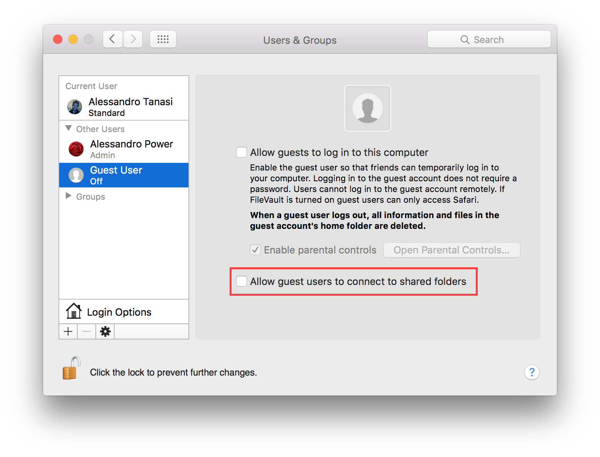

Disable password hints
^^^^^^^^^^^^^^^^^^^^^^

Passwords hints are supposed to help an user to remember his password but could
also help attackers.
It is suggested to disable password hints, go to:

    System Preferences ⇒ Users & Groups ⇒ Login Options

Un-check "Show password hints".

.. image:: images/settings_users_1.png
   :align: center

Disable recent items
^^^^^^^^^^^^^^^^^^^^

Recent items are used to track your latest activity, it is also a feature
used in forensics investigation to create the user activity timeline.
It is suggested to not track last recently used items.
Go to:

    System Preferences ⇒ General

Set “Recent items” to “None”.

.. image:: images/settings_general_1.png
   :align: center

Disable Localization Services
^^^^^^^^^^^^^^^^^^^^^^^^^^^^^

By default Spotlight is allowed to use localization services to help you
offering localized results.
Due to his implementation it needs to send your position to a remote service.
It is suggested to disable this behavior.
Go to:

    System Preferences ⇒ Security & Privacy ⇒ Privacy ⇒ Location Services

Select "System Services" and click "Details...".
It is suggested to disable localization for all services, if not needed.

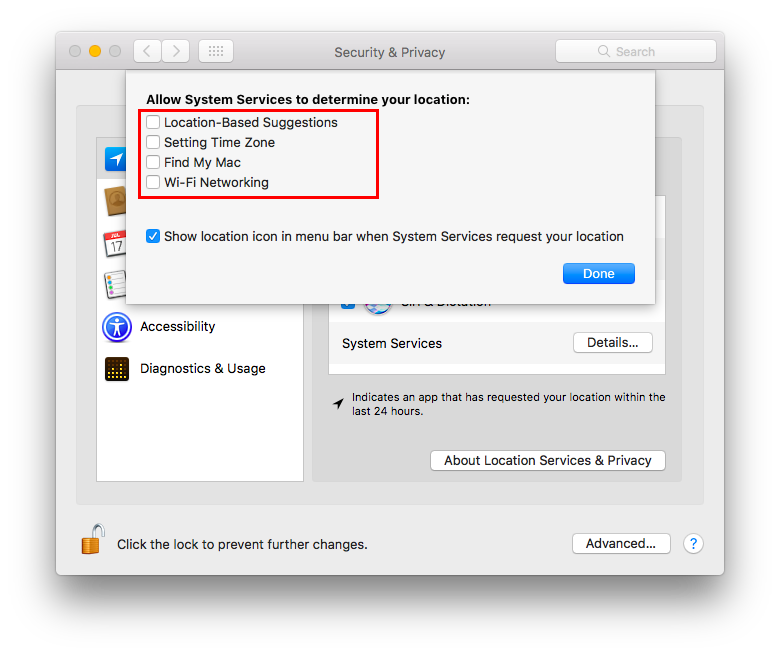

Disable Spotlight Suggestions
^^^^^^^^^^^^^^^^^^^^^^^^^^^^^

By default Spotlight shows suggestions from the Internet, it sends your search
to Apple services and provides results back.
It is suggested to use Spotlight only locally to prevent leaking your search.
To disable Spotlight Suggestions go to:

    System Preferences ⇒ Spotlight

Un-check "Allow Spotlight Suggestions in Spotlight and Look Up".

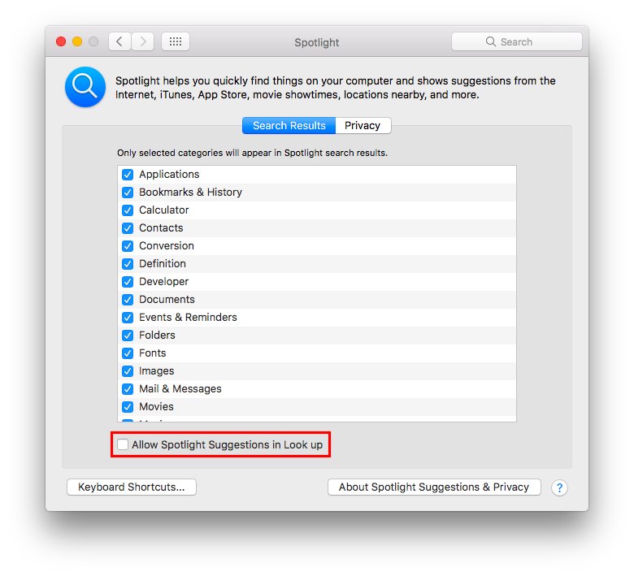

It is suggested to disable Spotlight Suggestions to avoid leaking your search to
online services used for suggestions, go to:

    System Preferences ⇒ Spotlight

Un-check "Spotlight Suggestions" from the list of results categories.

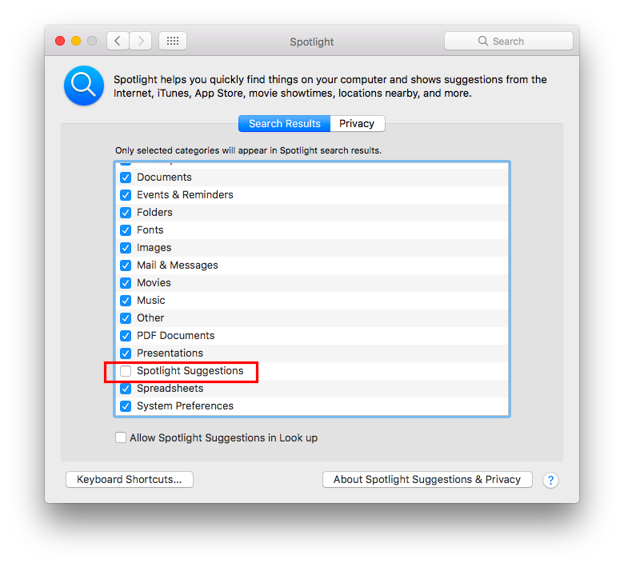

Enable FileVault
^^^^^^^^^^^^^^^^

It is suggested to enable FileVault to enable full disk encryption on your
device. It should be already enabled by default.
Go to:

    System Preferences ⇒ Security & Privacy ⇒ FileVault

Enable FileVault.

Enable Firewall
^^^^^^^^^^^^^^^

It is suggested to enable the Firewall and have it always running.
Go to:

    System Preferences ⇒ Security & Privacy ⇒ Firewall

Click on "Turn On Firewall".

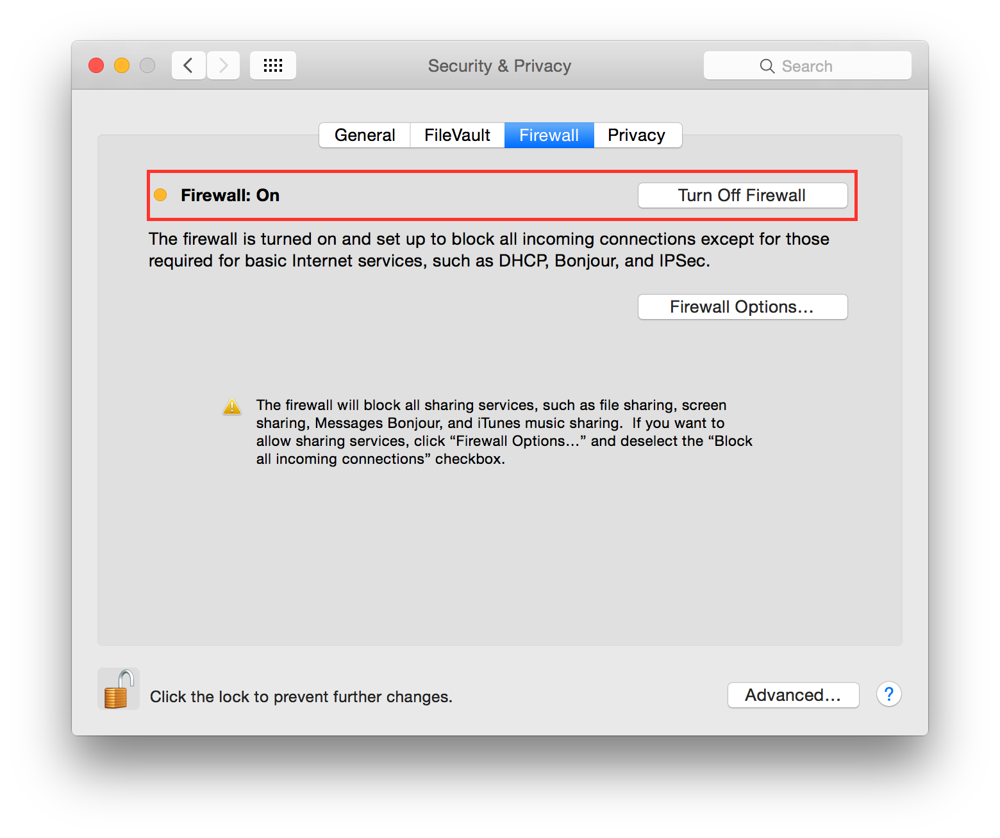

Now click on "Firewall options", a new panel will appear.
Click on "Block all incoming connections".

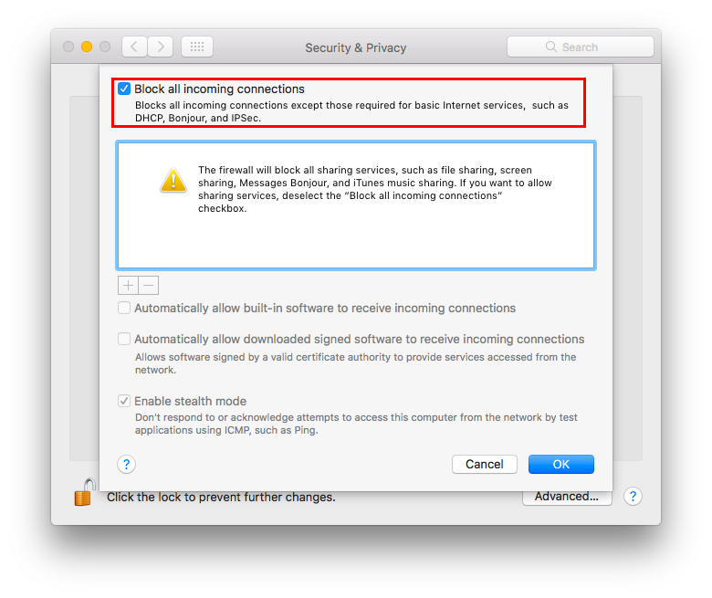

Using "Block all incoming connections" will block all incoming connections to
your host. This will block also all sharing services, such as file sharing,
screen sharing, Messages Bonjour, iTunes music sharing and other features.
If your host is providing any kind of service, this option is not suggested;
you should disable it.

Enable screen saver
^^^^^^^^^^^^^^^^^^^

It is suggested to enable the screen saver to automatically lock your screen
after a while.
Go to:

    System Preferences ⇒ Desktop & Screen Saver ⇒ Screen Saver

Set "Start after" to "5 Minutes".

.. image:: images/settings_desktop_1.png
   :align: center

Empty trash securely
^^^^^^^^^^^^^^^^^^^^

When you delete a file, OS X only deletes the index entry for the file, which
tells the system the file’s contents are free to be overwritten; however, the
data still remains and may be recovered using a forensics software.
It is a good practice to always empty your trash securely. Your data will be
securely wiped from disk in an irreversible way.
In the previous OS X releases there was an option to enable safe delete,  Apple
has removed this feature in OS X El Capitan. However, you can use command line
tools.

You can use the *rm* command from Terminal to delete files with the *-P* option,
as stated in *man rm* this option is used to::

    Overwrite regular files before deleting them. Files are
    overwritten three times, first with the byte pattern 0xff,
    then 0x00, and then 0xff again, before they are deleted.

For example if you what to delete *test.pdf* you should open Terminal and use::

    $ rm -P test.pdf

Erase free space
^^^^^^^^^^^^^^^^

In some cases, you might want to run an overwrite task on the free space of a
given drive.
You can use the *diskutil* command line utility, open Terminal and use::

    diskutil secureErase freespace LEVEL /Volumes/DRIVE_NAME

In this command, change LEVEL to a number of 0 through 4, the available options
are:
 * *0* is a single-pass of zeros
 * *1* is a single-pass of random numbers
 * *2* is a 7-pass erase
 * *3* is a 35-pass erase
 * *4* is a 3-pass erase

Change DRIVE_NAME to the name of the mount point.

Power off memory during standy
^^^^^^^^^^^^^^^^^^^^^^^^^^^^^^

By default during stand-by memeory are kept powered on, this is prone to
forensics acquisition of your memory.
As stated in *man pmset*::

  hibernatemode supports values of 0, 3, or 25. Whether or not a hiberna-
  tion image gets written is also dependent on the values of standby and
  autopoweroff

  For example, on desktops that support standby a hibernation image will be
  written after the specified standbydelay time. To disable hibernation
  images completely, ensure hibernatemode standby and autopoweroff are all
  set to 0.

  hibernatemode = 0 by default on desktops. The system will not back memory
  up to persistent storage. The system must wake from the contents of mem-
  ory; the system will lose context on power loss. This is, historically,
  plain old sleep.

  hibernatemode = 3 by default on portables. The system will store a copy
  of memory to persistent storage (the disk), and will power memory during
  sleep. The system will wake from memory, unless a power loss forces it to
  restore from hibernate image.

  hibernatemode = 25 is only settable via pmset. The system will store a
  copy of memory to persistent storage (the disk), and will remove power to
  memory. The system will restore from disk image. If you want "hiberna-
  tion" - slower sleeps, slower wakes, and better battery life, you should
  use this setting.

It is suggested to power off memory at stand-by with the following command::

  sudo pmset hibernatemode 25

Require an administration password
^^^^^^^^^^^^^^^^^^^^^^^^^^^^^^^^^^

Always require an administration password to access system settings.
Go to:

    System Preferences ⇒ Security & Privacy ⇒ Advanced

Check "Require an administrator password to access system-wide preferences".

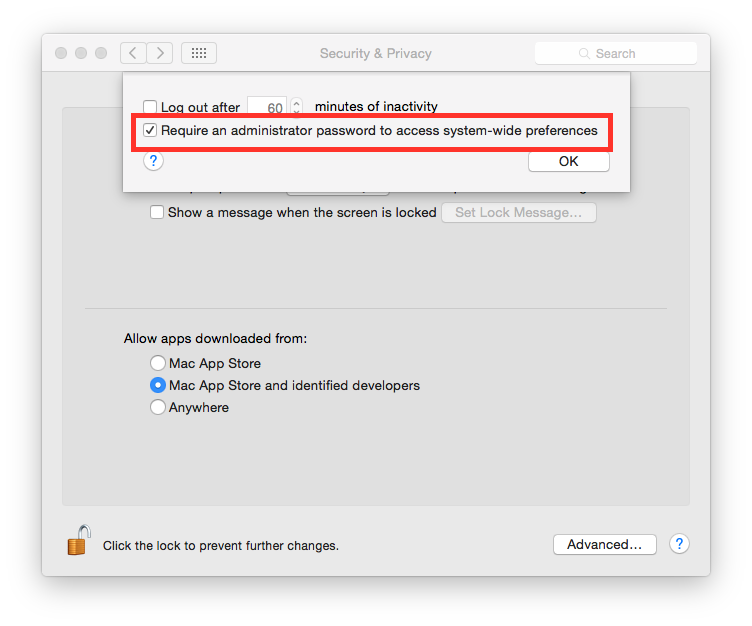

Require password to un-lock
^^^^^^^^^^^^^^^^^^^^^^^^^^^

Requires password to un-lock from sleep or screen saver.
Go to:

    System Preferences ⇒ Security & Privacy ⇒ General

Set "Require password immediately after sleep or screen saver begins".

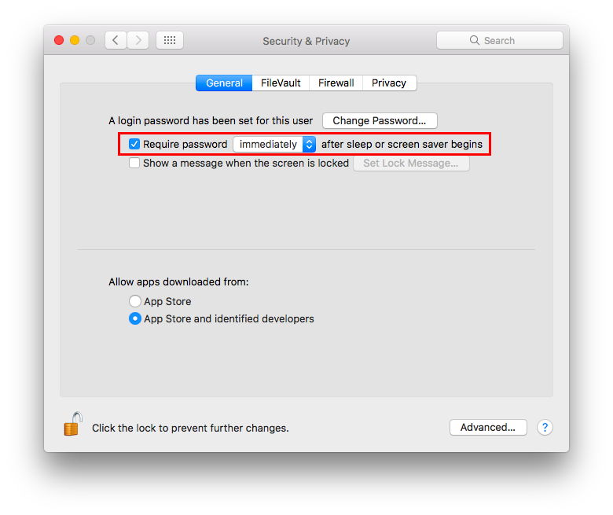

Save to Disk by Default
^^^^^^^^^^^^^^^^^^^^^^^

Many applications bundled in OS X, i.e. Text, save by default new documents to
iCloud.
It is suggested to set default save target to be a local disk, not iCloud with
the following command, open Terminal and type::

    defaults write NSGlobalDomain NSDocumentSaveNewDocumentsToCloud -bool false

Set a Firmware Password
^^^^^^^^^^^^^^^^^^^^^^^

Enabling an optional firmware password offers an increased level of protection.
A firmware password is set on the actual Mac logicboards firmware, it is an EFI
password which prevents your Mac from being booted from an external boot volume,
single user mode, or target disk mode, and it also prevents resetting of PRAM
and the ability to boot into Safe Mode.
Years ago firmware passwords could be easily bypassed by removing memory.
These days Mac's firmware password isn't easily reset. Apple only suggests to
bring your Mac in to an authorized Apple Service Provider and have them do it
there.

It is suggested to set a firmware password:

 * Power off your Mac and turn it on.
 * Activate Recovery Mode (holding down the Command and R keys at boot).
 * After a while OS X Utilities will appear.
 * Click on the Utilities menu from the menu bar.
 * Select Firmware Password Utility.
 * Click on 'Turn On Firmware Password' and follow the wizard.
 * When done, restart your Mac.

Show all filename extensions
^^^^^^^^^^^^^^^^^^^^^^^^^^^^

It is a good practice to always show file names extensions.
Start Finder app.
Go to:

    Preferences ⇒ Advanced

Check "Show all filename extensions".

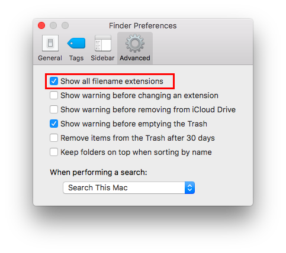

Show when localization is used
^^^^^^^^^^^^^^^^^^^^^^^^^^^^^^

System services could ask to use localization data.
It is suggested to show location icon when localization data are requested.
Go to:

    System Preferences ⇒ Security & Privacy ⇒ Privacy ⇒ Location Services

Select "System Services" and click "Details...".
Check "Show location icon in the menu bar when System Services request your
location".

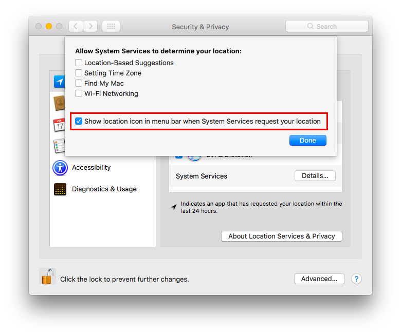

Users privilege separation
^^^^^^^^^^^^^^^^^^^^^^^^^^

It is suggested to use different accounts for administration and normal use.
Create an account with admin privileges for special tasks and maintenance and a
regular user for your normal use.
Don't use the same password for both.

References
^^^^^^^^^^

* https://github.com/herrbischoff/awesome-osx-command-line