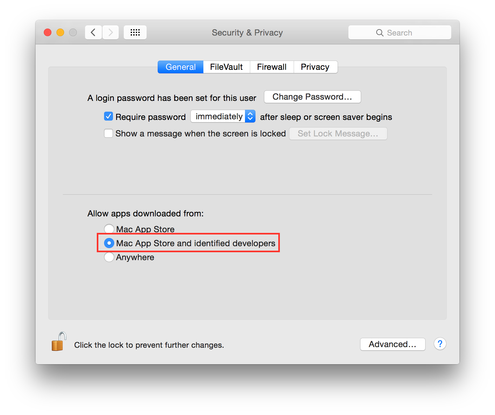
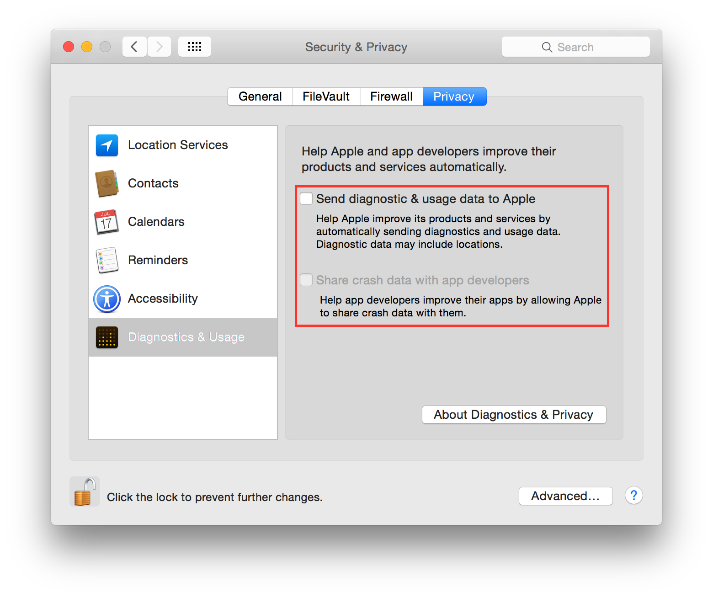
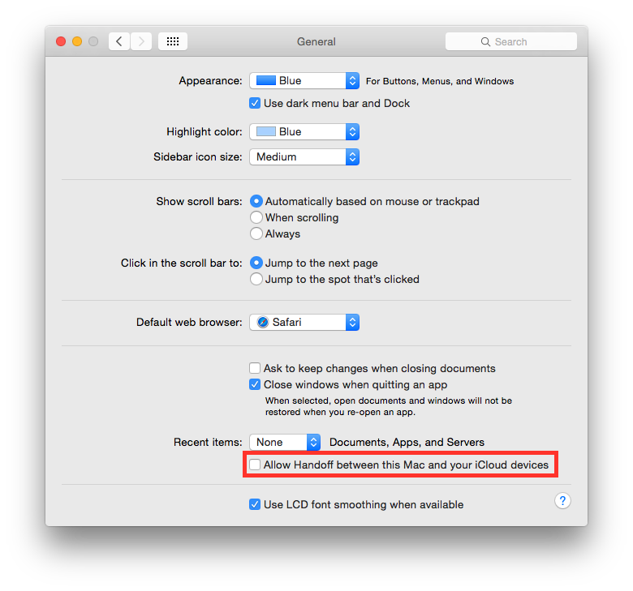
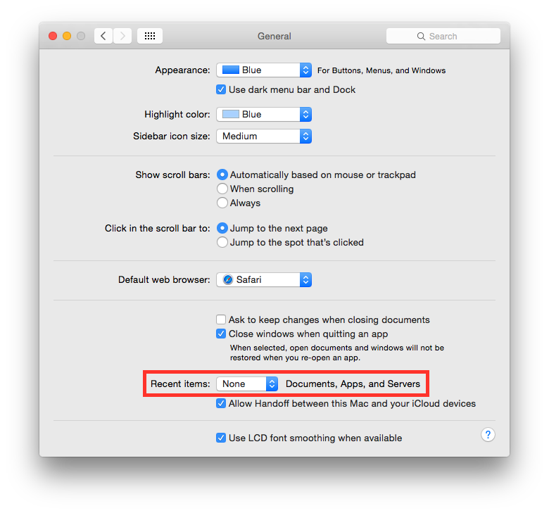
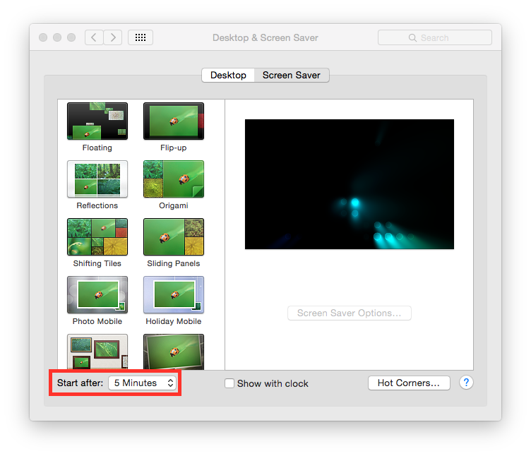
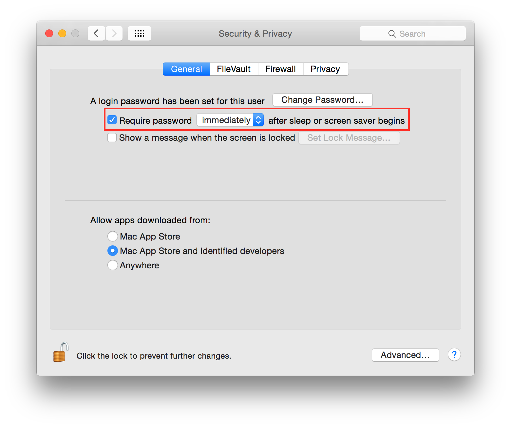

Mac OSX 10.10 Yosemite
----------------------

According to `Wikipedia <http://en.wikipedia.org/wiki/OS_X_Yosemite>`_ Yosemite is *"OS X Yosemite (version 10.10) is
the eleventh major release of OS X, Apple Inc.'s desktop and server operating system for Macintosh computers"*.

.. contents::
   :local:

Applications
^^^^^^^^^^^^

It is suggested to keep the /Applications/ directory as clean as possible, and having a separate directory for your
personal apps lets you do that easily.
Just create a folder named “Applications” in your home directory (or where you like).

Allow only signed apps
^^^^^^^^^^^^^^^^^^^^^^

It is suggested to never run untrusted code not signed with a proper key.
To allow only apps signed by an authorized developer, go to:

    System Preferences ⇒ Security & Privacy ⇒ General

Set "Allow apps download from" to "Mac App Store and identified developers".

Disable Diagnostics
^^^^^^^^^^^^^^^^^^^

It is suggested to disable diagnostic data and usage data sending to Apple.
Go to:

    System Preferences ⇒ Security & Privacy ⇒ Privacy ⇒ Diagnostics & Usage

Uncheck "Send diagnostic & usage data to Apple".
Uncheck "Share crash data with app developers".

Disable Handoff
^^^^^^^^^^^^^^^

Handoff is a great feature to keep your work in sync but it needs to send some data to Apple to work. It is suggested to
disable it.
Go to:

    System Preferences ⇒ General

Uncheck "Allow Handoff between this Mac and your iCloud devices".

Disable recent items
^^^^^^^^^^^^^^^^^^^^

Do not track last recently used items.
Go to:

    System Preferences ⇒ General

Set “Recent items” to “None”.

Disable Spotlight localization
^^^^^^^^^^^^^^^^^^^^^^^^^^^^^^

By default Spotlight is allowed to use localization services to help you offering localized results.
Go to:

    System Preferences ⇒ Security & Privacy ⇒ Privacy ⇒ Location Services

Select "System Services" and click "Details...".
Uncheck "Spotlight Suggestions".

.. image:: images/settings_security_3.png
   :align: center

Enable FileVault
^^^^^^^^^^^^^^^^

It is suggested to enable FileVault to enable full disk encryption on your device. It should be already enabled by default.
Go to:

    System Preferences ⇒ Security & Privacy ⇒ FileVault

Enable FileVault.

Enable Firewall
^^^^^^^^^^^^^^^

It is suggested to enable the Firewall and always have one running.
Go to:

    System Preferences ⇒ Security & Privacy ⇒ Firewall

Click on "Turn On Firewall".

.. image:: images/settings_security_5.png
   :align: center

Now click on "Firewall options", a new panel will appear.
Click on "Block all incoming connections".

.. image:: images/settings_security_6.png
   :align: center

Enable screen saver
^^^^^^^^^^^^^^^^^^^

It is suggested to enable the screen saver to automatically lock your screen after a while.
Go to:

    System Preferences ⇒ Desktop & Screen Saver ⇒ Screen Saver

Set "Start after" to "5 Minutes".

Empty trash securely
^^^^^^^^^^^^^^^^^^^^

It is a good practice to always empty your trash securely.
Start Finder app.
Go to:

    Preferences ⇒ Advanced

Check "Empty trash securely".

.. image:: images/finder_2.png
   :align: center

Require an administration password
^^^^^^^^^^^^^^^^^^^^^^^^^^^^^^^^^^

Always require an administration password to access system settings.
Go to:

    System Preferences ⇒ Security & Privacy ⇒ Advanced

Check "Require an administrator password to access system-wide preferences".

.. image:: images/settings_security_7.png
   :align: center

Require password to un-lock
^^^^^^^^^^^^^^^^^^^^^^^^^^^

Requires password to un-lock from sleep or screen saver.
Go to:

    System Preferences ⇒ Security & Privacy ⇒ General

Set "Require password immediately after sleep or screen saver begins".

Show all filename extensions
^^^^^^^^^^^^^^^^^^^^^^^^^^^^

It is a good practice to always show file names extensions.
Start Finder app.
Go to:

    Preferences ⇒ Advanced

Check "Show all filename extensions".

.. image:: images/finder_1.png
   :align: center

Users privilege separation
^^^^^^^^^^^^^^^^^^^^^^^^^^

It is suggested to use different accounts for administration and daily activities.
Create an account with admin privileges for special tasks and maintenance and a normal user for your daily use.
