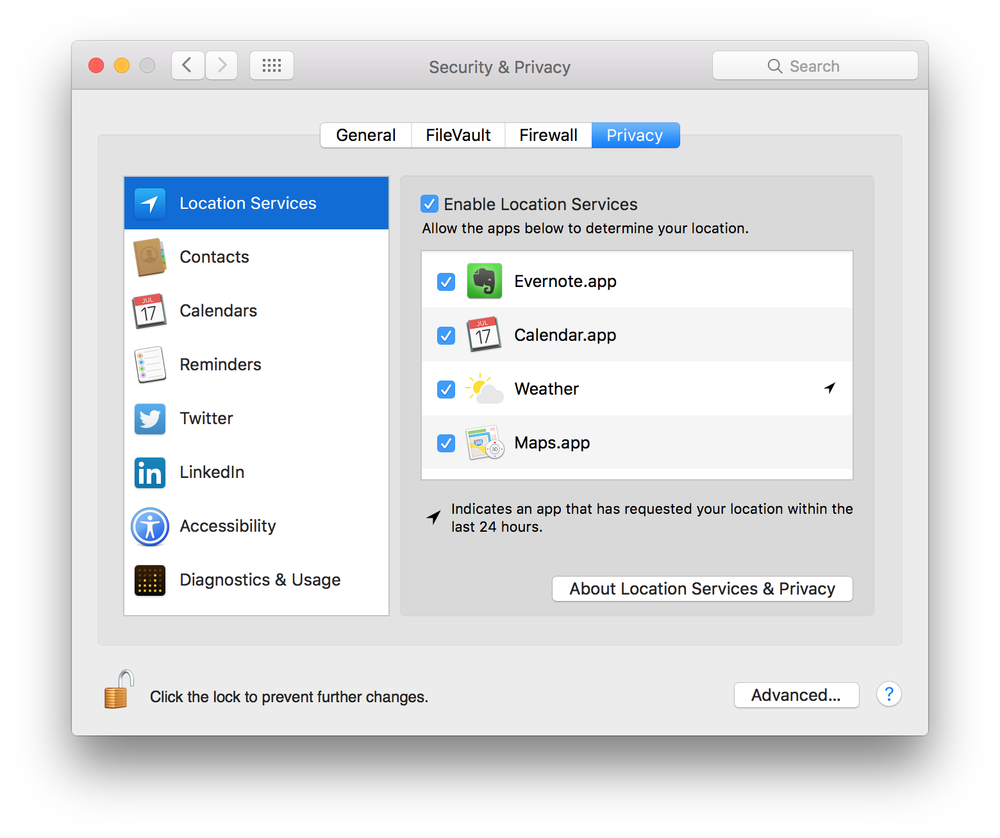
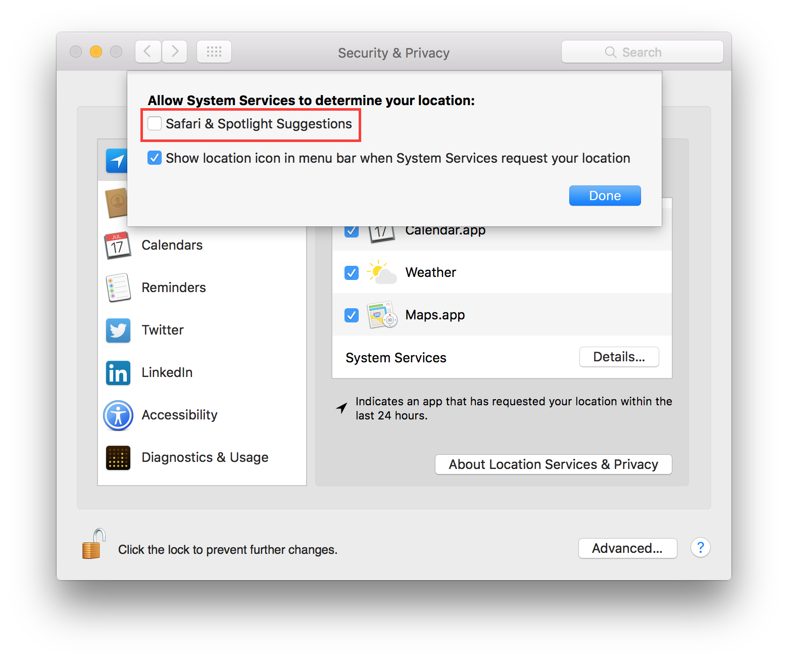
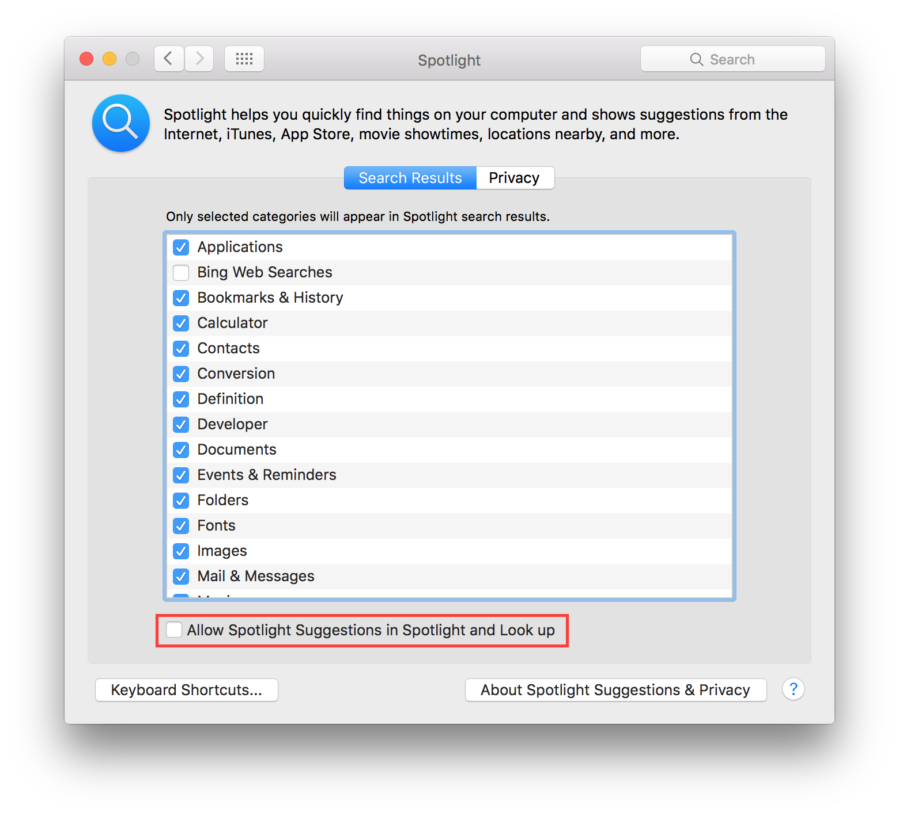
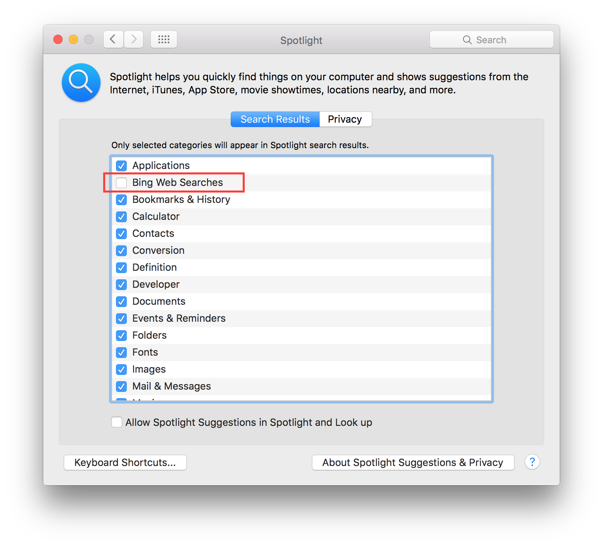
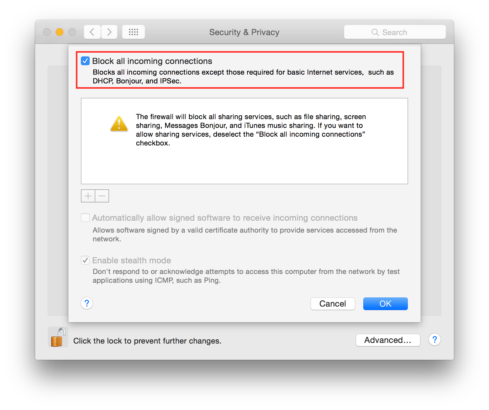
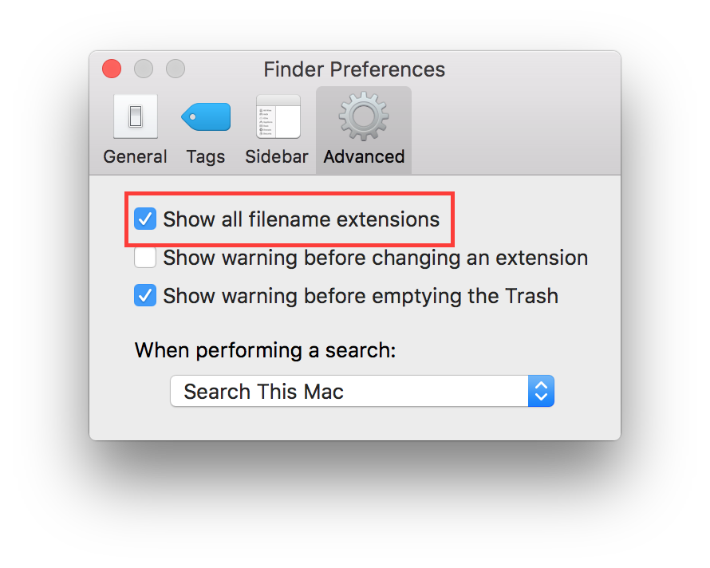
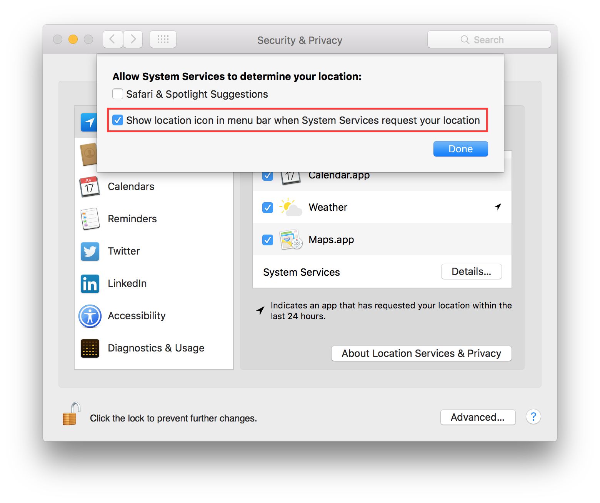

Mac OSX 10.11 El Capitan
------------------------

According to `Wikipedia <https://en.wikipedia.org/wiki/OS_X_El_Capitan>`_ El
Capitan is *"(version 10.11) is the twelfth major release of OS X, Apple Inc.'s
desktop and server operating system for Macintosh computers. It is the successor
to OS X Yosemite and focuses mainly on performance, stability and security.
Following the California landmark-based naming scheme introduced with OS X
Mavericks, El Capitan was named after a rock formation in Yosemite National
Park."*.

.. contents::
   :local:

Applications
^^^^^^^^^^^^

It is suggested to keep the */Applications/* directory as clean as possible,
having a separate directory for your personal apps lets you do that easily.
Just create a folder named “Applications” in your home directory (or where you
like) and install all applications there. Apps installed via App Store or some
special apps cannot live in a custom Applications folder, so you have to keep
them in the original path.

Allow only signed apps
^^^^^^^^^^^^^^^^^^^^^^

It is suggested to never run untrusted code not signed with a proper key.
To allow only apps signed by an authorized developer, go to:

    System Preferences ⇒ Security & Privacy ⇒ General

Set "Allow apps download from" to "Mac App Store and identified developers" or
if you want to be more strict and you install applications only via App Store
set it to "Mac App Store".

.. image:: images/settings_security_2.png
   :align: center

Check Privacy permissions
^^^^^^^^^^^^^^^^^^^^^^^^^

OS X allows you to track all applications requesting access to some sort of
sensitive data, for example your location or your contacts.
It is suggested to periodically check the list of applications requesting access
to sensitive data and review their permissions.
To show the list of these applications go to:

    System Preferences ⇒ Security & Privacy ⇒ Privacy

Disable Diagnostics
^^^^^^^^^^^^^^^^^^^

It is suggested to disable diagnostic data and usage data sending to Apple.
Go to:

    System Preferences ⇒ Security & Privacy ⇒ Privacy ⇒ Diagnostics & Usage

Un-check "Send diagnostic & usage data to Apple".
Un-check "Share crash data with app developers".

.. image:: images/settings_security_4.png
   :align: center

Disable Handoff
^^^^^^^^^^^^^^^

Handoff is a great feature to keep your work in sync between Apple devices.
Due to his implementation it needs to send some data to Apple iCloud to work, so
in some way it is leaking your data.
It is suggested to disable it.
Go to:

    System Preferences ⇒ General

Un-check "Allow Handoff between this Mac and your iCloud devices".

.. image:: images/settings_general_2.png
   :align: center

Disable recent items
^^^^^^^^^^^^^^^^^^^^

Recent items are used to track your latest activity, it is also a feature
used in forensics investigation to create the user activity timeline.
It is suggested to not track last recently used items.
Go to:

    System Preferences ⇒ General

Set “Recent items” to “None”.

.. image:: images/settings_general_1.png
   :align: center

Disable Spotlight localization
^^^^^^^^^^^^^^^^^^^^^^^^^^^^^^

By default Spotlight is allowed to use localization services to help you
offering localized results.
Due to his implementation it needs to send your position to a remote service.
It is suggested to disable this behavior.
Go to:

    System Preferences ⇒ Security & Privacy ⇒ Privacy ⇒ Location Services

Select "System Services" and click "Details...".
Un-check "Safari & Spotlight Suggestions".

Disable Spotlight Suggestions
^^^^^^^^^^^^^^^^^^^^^^^^^^^^^

By default Spotlight shows suggestions from the Internet, it sends your search
to Apple services and provides results back.
It is suggested to use Spotlight only locally to prevent leaking your search.
To disable Spotlight Suggestions go to:

    System Preferences ⇒ Spotlight

Un-check "Allow Spotlight Suggestions in Spotlight and Look Up".

It is suggested to disable results from Bing to avoid leaking your search to
Bing, go to:

    System Preferences ⇒ Spotlight

Un-check "Bing Web Searches" from the list of results categories.

Enable FileVault
^^^^^^^^^^^^^^^^

It is suggested to enable FileVault to enable full disk encryption on your
device. It should be already enabled by default.
Go to:

    System Preferences ⇒ Security & Privacy ⇒ FileVault

Enable FileVault.

Enable Firewall
^^^^^^^^^^^^^^^

It is suggested to enable the Firewall and have it always running.
Go to:

    System Preferences ⇒ Security & Privacy ⇒ Firewall

Click on "Turn On Firewall".

.. image:: images/settings_security_5.png
   :align: center

Now click on "Firewall options", a new panel will appear.
Click on "Block all incoming connections".

Using "Block all incoming connections" will block all incoming connections to
your host. This will block also all sharing services, such as file sharing,
screen sharing, Messages Bonjour, iTunes music sharing and other features.
If your host is providing any kind of service, this option is not suggested;
you should disable it.

Enable screen saver
^^^^^^^^^^^^^^^^^^^

It is suggested to enable the screen saver to automatically lock your screen
after a while.
Go to:

    System Preferences ⇒ Desktop & Screen Saver ⇒ Screen Saver

Set "Start after" to "5 Minutes".

.. image:: images/settings_desktop_1.png
   :align: center

Empty trash securely
^^^^^^^^^^^^^^^^^^^^

When you delete a file, OS X only deletes the index entry for the file, which
tells the system the file’s contents are free to be overwritten; however, the
data still remains and may be recovered using a forensics software.
It is a good practice to always empty your trash securely. Your data will be
securely wiped from disk in an irreversible way.
In the previous OS X releases there was an option to enable safe delete,  Apple
has removed this feature in OS X El Capitan. However, you can use command line
tools.

You can use the *rm* command from Terminal to delete files with the *-P* option,
as stated in *man rm* this option is used to::

    Overwrite regular files before deleting them. Files are
    overwritten three times, first with the byte pattern 0xff,
    then 0x00, and then 0xff again, before they are deleted.

For example if you what to delete *test.pdf* you should open Terminal and use::

    $ rm -P test.pdf

The *srm* command is specifically designed for secure deletion from command
line, as stated in *man srm*::

    srm  removes each specified file by overwriting, renaming, and truncating
    it before unlinking. This prevents other people from undeleting  or
    recovering any information about the file from the command line.

For example if you what to delete *test.pdf* you should open Terminal and use::

    $ srm test.pdf

Erase free space
^^^^^^^^^^^^^^^^

In some cases, you might want to run an overwrite task on the free space of a
given drive.
You can use the *diskutil* command line utility, open Terminal and use::

    diskutil secureErase freespace LEVEL /Volumes/DRIVE_NAME

In this command, change LEVEL to a number of 0 through 4, the available options
are:
 * *0* is a single-pass of zeros
 * *1* is a single-pass of random numbers
 * *2* is a 7-pass erase
 * *3* is a 35-pass erase
 * *4* is a 3-pass erase

Change DRIVE_NAME to the name of the mount point.

Require an administration password
^^^^^^^^^^^^^^^^^^^^^^^^^^^^^^^^^^

Always require an administration password to access system settings.
Go to:

    System Preferences ⇒ Security & Privacy ⇒ Advanced

Check "Require an administrator password to access system-wide preferences".

.. image:: images/settings_security_7.png
   :align: center

Require password to un-lock
^^^^^^^^^^^^^^^^^^^^^^^^^^^

Requires password to un-lock from sleep or screen saver.
Go to:

    System Preferences ⇒ Security & Privacy ⇒ General

Set "Require password immediately after sleep or screen saver begins".

.. image:: images/settings_security_1.png
   :align: center

Show all filename extensions
^^^^^^^^^^^^^^^^^^^^^^^^^^^^

It is a good practice to always show file names extensions.
Start Finder app.
Go to:

    Preferences ⇒ Advanced

Check "Show all filename extensions".

Show when localization is used
^^^^^^^^^^^^^^^^^^^^^^^^^^^^^^

System services could ask to use localization data.
It is suggested to show location icon when localization data are requested.
Go to:

    System Preferences ⇒ Security & Privacy ⇒ Privacy ⇒ Location Services

Select "System Services" and click "Details...".
Check "Show location icon in the menu bar when System Services request your
location".

Users privilege separation
^^^^^^^^^^^^^^^^^^^^^^^^^^

It is suggested to use different accounts for administration and normal use.
Create an account with admin privileges for special tasks and maintenance and a
regular user for your normal use.
Don't use the same password for both.
